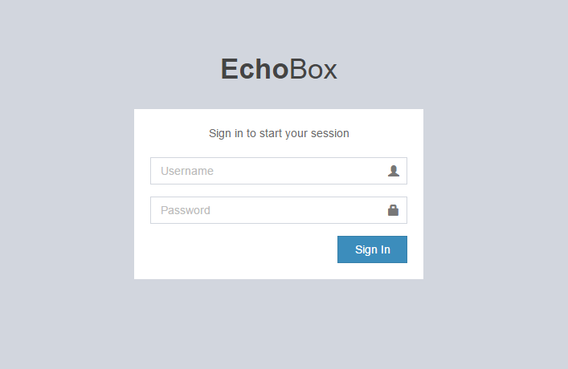
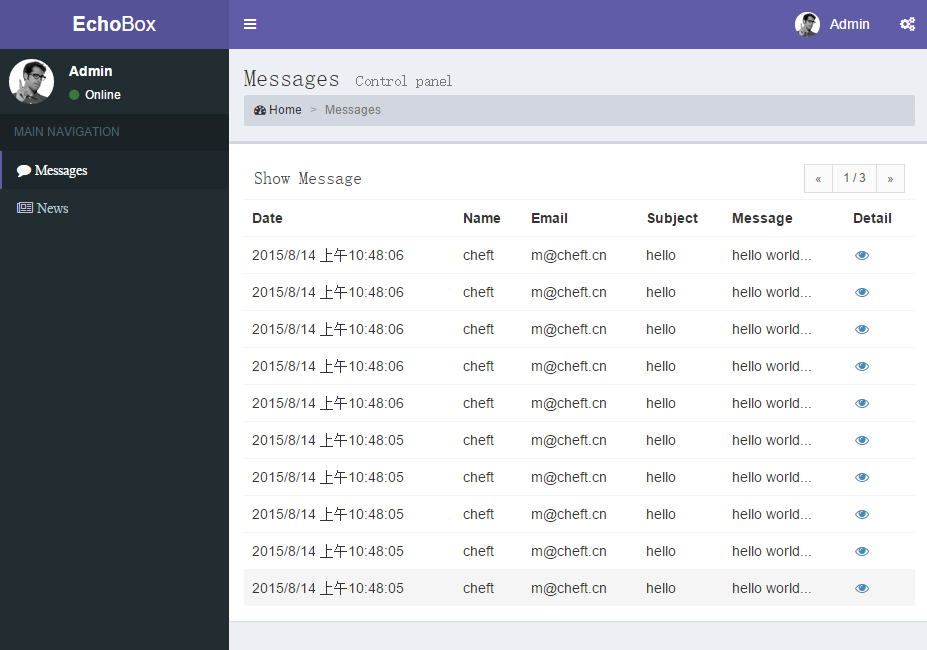

# cheft
a riot isomorphic framework base on riot & express

## Fatures
* JS fast rendering
* SEO friendly
* Support html5 pushState
* Support hashchange if IE < 10
* Support IE9+

## [Demo](http://echoboxd.coding.io/)

    npm install
    gulp
    node server

> tip: username/password is admin/admin

## Notes

### library
* [riot](https://muut.com/riotjs/)
* [express](http://expressjs.com)
* [waterline](https://github.com/balderdashy/waterline-docs)
* [superagent](https://github.com/visionmedia/superagent)

### Cheft Element

#### client
client.js

	var client = require('./lib/client');
	var config = require('./config');
	var router = require('./app/router');
	var app = window.app = client(config, router);
	...
	app.start();

#### server
server.js

	var server = require('./lib/server');
	var config = require('./config');
	var router = require('./app/router');
	var dbconfig = require('./db');
	var app = root.app = server(config, router, dbconfig);
	...
	app.start();

#### common router
app/router.js

	module.exports = function(router) {
		router.get('/', function(req, rep) {
			return rep.render('messages');
		});

		router.get('/login', function(req, rep) {
			return rep.render('login', {template: 'login.html'});
		});

	    router.get('/messages/:id', function(req, rep) {
	        return rep.render('message-detail', {params: [req.params.id]});
	    });

	    router.get('/news/:id', function(req, rep) {
	        return rep.render('new-detail', {params: [req.params.id]});
	    });

		router.get('/:tagName', function(req, rep) {
			return rep.render(req.params.tagName, {params: [req.params.tagName]});
		});
	}

* template - public/*.html, default _index.html_
* params -  tag.opts.params

#### tag 
{tagName}/index.html

	<{tagName}>
		
		

			...
		

		<style</style>
	</{tagName}>

{tagName}/mixin.js

	module.exports = {
		on: {
			init    :  function() {}
			initData:  function() {}
	        mount   :  function() {}
	        update  :  function() {}
	        updated :  function() {}
	        unmount :  function() {}
	        custom  :  function(data) {}
		},
		do: {
			clicked : function(e) {
				this.trigger('custom', 'hello');
			}
		}
	}

> server only run init and initData event,  such window, docuemnt don't use on init and initData

#### server router
{tagName}/router.js

	module.exports = function(router) {
	 
	    router.get('/:id', function(req, rep) {
	    	...
	    });

	    router.get('/', function(req, rep) {
	        ...
	    });

	    router.post('/', function(req, rep) {
	        ...
	    });

	    router.put('/:id', function(req, rep) {
	        ...
	    });

	    router.delete('/:id', function(req, rep) {
	        ...
	    });
	};

> router's access uri: config.apiPrefix + {tagName} + current route

#### model
{tagName}/model.js

	module.exports = {
	    identity: 'messages',
	    connection: 'myLocalDisk',
	    autoRoute: true,
	    attributes: {
	        name: 'string',
	        email: 'string',
	        subject: 'string',
	        message: 'string'
	    }
	}

* autoRoute is true, Can auto generate CRUD　route.
* base waterline, call method such: app.model.user.find({}, cb)

### rest, support client and server
base superagent, app.rest.

* get(url, data, cb)
* post(url, data, cb)
* put(url, data, cb)
* del(url, data, cb)
